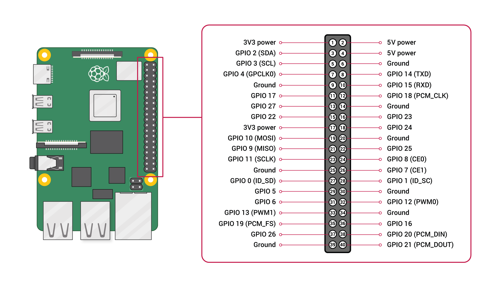

# Hardware Keyboard LED Trigger

My subpar code hooks into the linux hardware event subsystem (`/dev/input/`) to monitor a physical USB keyboard (not tested on USB-C).
When any key is pressed, it activates an LED connected to the Raspberry Pi 4 B's GPIO pins, all without interfering with active SSH (Secure Shell) sessions or logging keystrokes to the console.

## Hardware Wiring
* **GPIO 17 (Pin 11)** -> 220Ω or 330Ω Resistor -> **Long leg (Anode)** of LED
* **GND (Pin 9)** <- **Short leg (Cathode)** of LED
* Physical USB Keyboard plugged into the Pi.

## Set this up

1. **Clone the repository:**
   ```bash
   git clone [https://github.com/BrentanRath/Hardware-Keyboard-LED-Trigger](https://github.com/BrentanRath/Hardware-Keyboard-LED-Trigger)
   cd engineering-project
   ```

2. **Create a virtual environment:**
   Modern Raspberry Pi OS requires virtual environments for Python packages.
   ```bash
   python3 -m venv venv
   ```

3. **Install the dependencies:**
   ```bash
   # Activate the environment
   source venv/bin/activate
   
   # Install required packages
   pip install -r requirements.txt
   ```

## How to use it

The script reads directly from hardware, so it requires `root` privileges. 

To run the script using the packages installed in your virtual environment, you **MUST** point `sudo` to the virtual environment's Python executable:

```bash
sudo ./venv/bin/python keyboard_led.py
```

* **To trigger:** Press any key on the physical USB keyboard (or in my case, drop something on it, not something 56.2 lbs though, don't hurt the cutie!)
* **To stop:** Press `Ctrl+C` in your SSH terminal, or simply unplug the USB keyboard.
* **To test** Run the led_test.py file to see if your led is working or not, this is to see if your wiring and hardware are correct.
* **To find the right pins** check this image [](https://raw.githubusercontent.com/BrentanRath/Hardware-Keyboard-LED-Trigger/refs/heads/main/raspi4pinlayout.png)

## What else do I need to do?
- [] make a working script to turn on the led with keyboard input
- [] add the pinboard guide to the github
- [] create requirements.txt so people can not suffer and this looks more professional
- [] create led testing script
- [] make README.md look pretty for github
- [] detial OS/packages used for process so people can do it from scratch (plus all exact version)
- [] record video of it working

*btw I challanged myself and used no LLM's or AI during this! while it is not the smart thing to do for coding, and I know how to code using LLM's quite effectively and efficiently, learning is different"

- [] add reasoning behind it (engineering project) + video of it in the project
